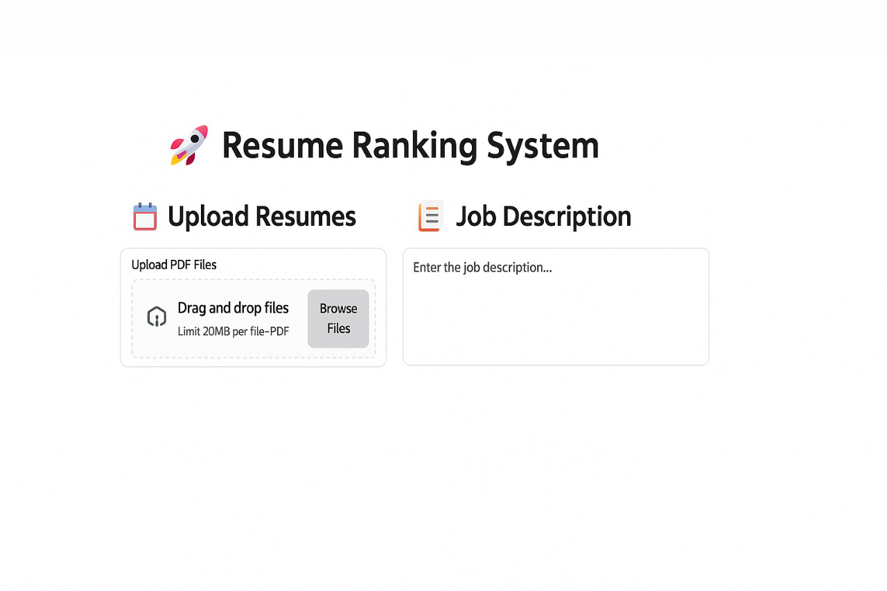
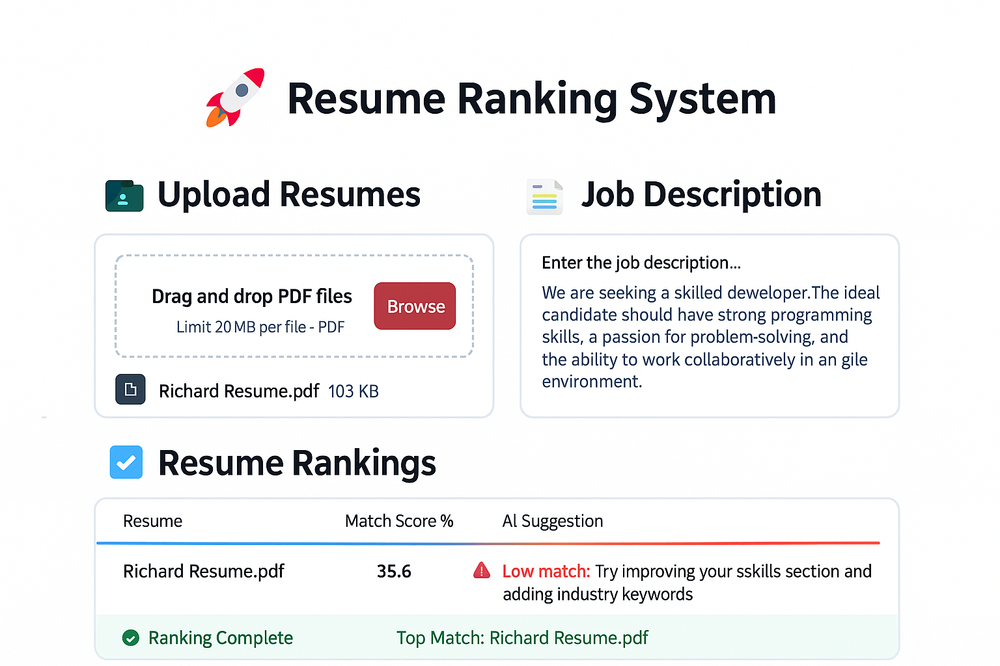
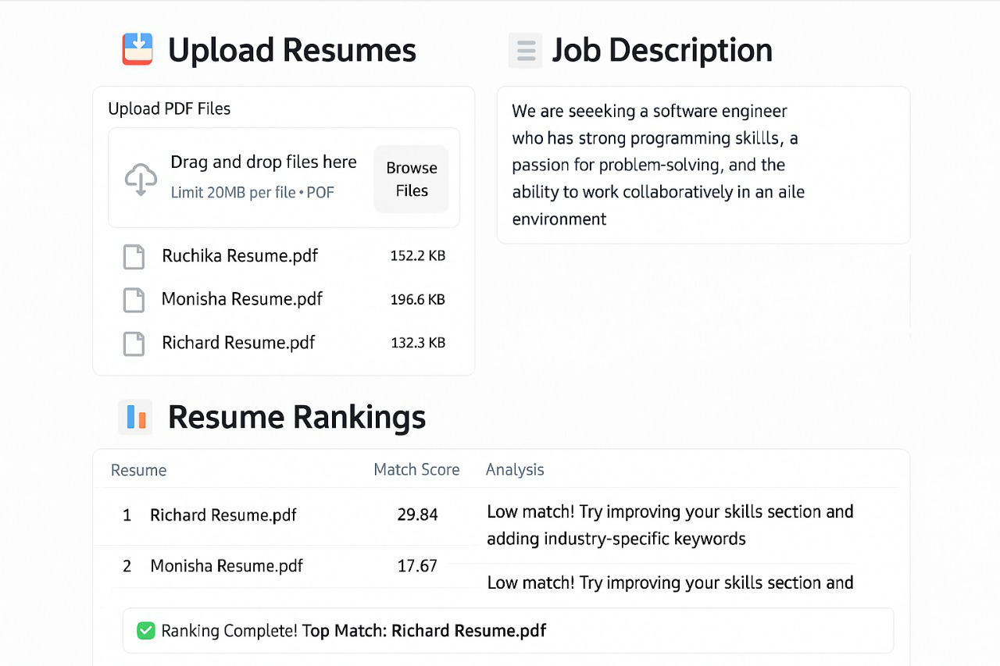

# AI-powered-Resume-Screening-and-Ranking-System

### An AI-powered system for automated resume screening and ranking based on job descriptions.

## 📖 Introduction
The **Resume Ranking System** is an AI-driven tool designed to simplify and optimize the hiring process. 
The AI-Powered Resume Screening and Ranking System is designed to streamline and enhance the recruitment process using advanced machine learning and natural language processing. This system allows recruiters and HR teams to automatically evaluate and rank resumes based on their relevance to a given job description. By reducing manual resume filtering, it saves time, minimizes bias, and ensures that only the most relevant candidates make it to the next stage of hiring.


## ✨ Features
- 📂 **Upload multiple resumes** (PDF format, max 200MB per file)
- 📝 **Input job description** to match candidate profiles
- 📊 **Resume ranking system** using NLP and ML techniques
- 🔍 **Match score (%)** to evaluate candidate relevance
- 💡 **AI suggestions** for resume improvement
- 🎨 **Dark theme UI** with a sleek, interactive design
- ☁ **Deployed using Streamlit**


✅Automated Resume Screening: Upload multiple resumes in PDF format and let the AI instantly analyze and rank them based on job requirements.

💡 Smart Matching Algorithm: Uses advanced text similarity and keyword extraction to calculate match scores.

📊 Real-Time Feedback: Provides instant suggestions on how candidates can improve their resumes for specific roles.

⚡ Bias Reduction: Minimizes human biases by offering objective match scores based purely on skill, experience, and relevance.

📥 User-Friendly Interface: Drag-and-drop functionality for resume upload and a simple job description input field.

🔍 Scalability: Suitable for both small companies and large enterprises to handle hundreds of resumes effortlessly.

## 🛠️ Tech Stack
- **Frontend & UI:** Streamlit
- **Backend:** Python, Flask
- **NLP Processing:** spaCy, NLTK, TF-IDF
- **Machine Learning:** Scikit-learn, KNN, Cosine Similarity
- **Data Handling:** Pandas, NumPy
- **Deployment:** Streamlit Cloud / Local Hosting

## 📷 Screenshots
### Upload Resumes & Enter Job Description



### Resume Ranking Results


## 🏗️ Installation & Setup 

### Install Dependencies
```bash
pip install -r requirements.txt
```

### Run the Application
```bash
streamlit run app.py
```

## 🎯 How It Works
1. **Upload resumes** (PDF format)
2. **Enter job description** in the input box
3. Click **Submit** to process and rank resumes
4. **View ranked resumes** with match scores & AI suggestions

## 📌 Future Enhancements
🌐 Integration with LinkedIn & Job Portals: Fetch resumes directly from popular platforms for seamless screening.

🤖 Enhanced AI Models: Incorporate GPT-powered models for deeper semantic understanding and better suggestion quality.

📧 Automated Candidate Notifications: Notify candidates about their match status and feedback automatically.

🧠 Personality and Soft Skills Analysis: Using NLP-based behavioral analysis to match not just hard skills but soft skills and culture fit.

📈 Analytics Dashboard: Provide recruiters with insightful metrics about the talent pool and hiring trends.

## 💡 Contributing
Contributions are welcome! Feel free to fork this repo and submit a pull request.

---
🚀 **Transform your hiring process with AI-powered resume ranking!**
